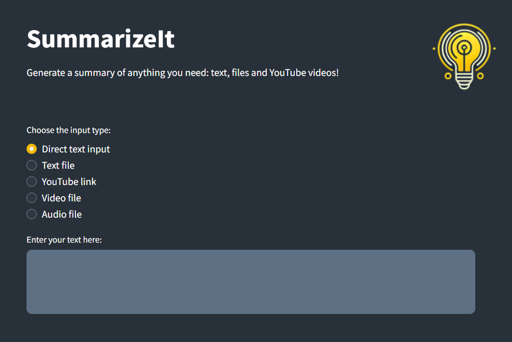
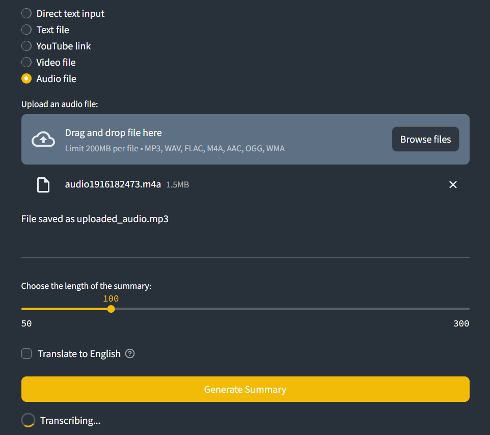
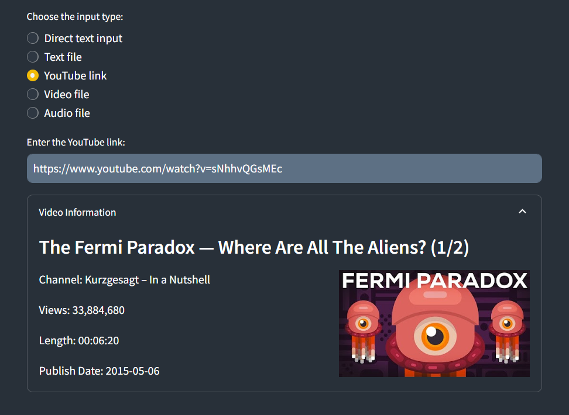
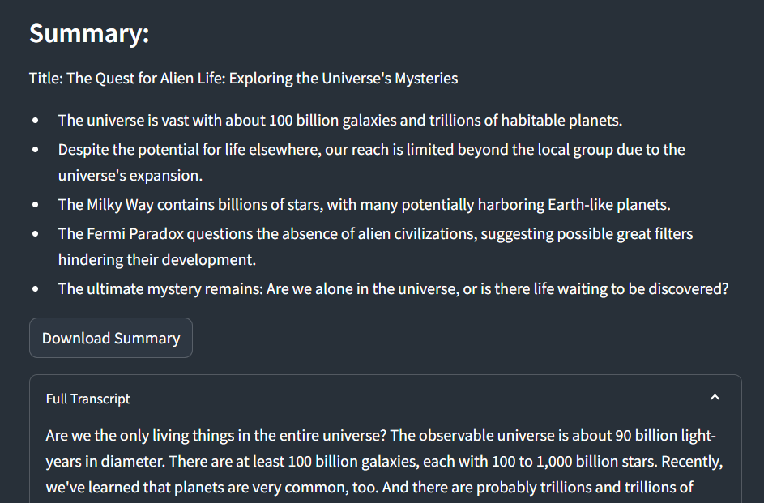

# SummarizeIT

**SummarizeIt** is a Streamlit application that generates summaries for text, files, and YouTube videos. It supports direct text input, text files, YouTube links, video files, and audio files. The application can transcribe audio, translate text to English, and generate concise summaries.

## Screenshots






## Setup

### Prerequisites

- Python 3.8+
- Streamlit
- OpenAI API Key

### Installation

1. Clone the repository:

   ```bash
   git clone https://github.com/piotr-ziolo/SummarizeIt.git
   cd daitician
   ```

2. Install dependencies:

   ```bash
   pip install -r requirements.txt
   ```

3. Set up environment variables:
   - Create a `.env` file in the root directory.
   - Add your OpenAI API key:
     ```
     OPENAI_API_KEY=your_openai_api_key
     ```

### Running the App

```bash
streamlit run app.py
```

## Contributing

Contributions are always welcome!

For major changes, please open an issue first
to discuss what you would like to change.

## Acknowledgements

This app was inspired by Andrei Dumitrescu's [penAI API with Python Bootcamp: ChatGPT API, GPT-4, DALL·E](https://udemy.com/course/openai-api-chatgpt-gpt4-with-python-bootcamp/)

## Authors

[Piotr Ziolo](https://www.linkedin.com/in/piotr-ziolo/)

## License

[MIT](https://choosealicense.com/licenses/mit/)
